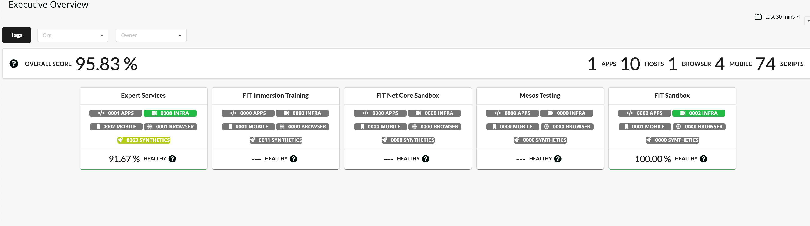
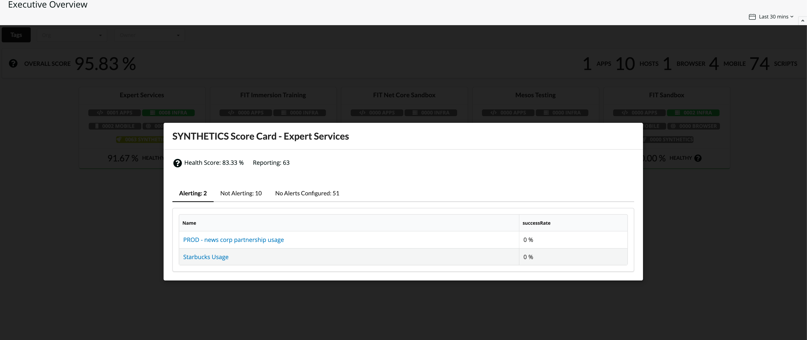
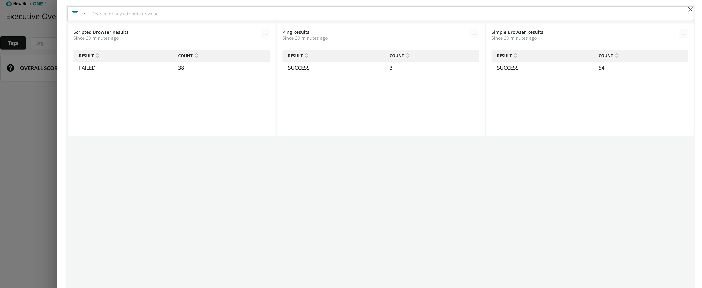

[](https://github.com/newrelic/open-source-office/blob/master/examples/categories/index.md#new-relic-experimental)

# New Relic One Executive View (nr1-executive-view)

  [](https://snyk.io/test/github/newrelic-experimental/nr1-executive-view)

An account health view focused on alerts. Will report on entities that are currently in a warning/critical state, or do not have any alerts configured. Key features:

* Ability to tag & filter accounts.
* Ability to add, edit, & view a drilldown dashboard for each loaded account tile.
* Individual health scores per product, per account and for all accounts rolled up.
* Counts of entities for all accounts, and per product.
* Drill into any entities (APM, Infrastructure, Browser, Mobile, Synthetics).

Health scores are currently calculated as such:

* **Product Level:** # entities not alerting / # entites w/ alerts configured
* **Account Level:** sum(product scores) / # of products w/ alerts configured
* **Overall:** sum(account scores) / # of accounts w/ alerts configured


## Usage
Quickly filter accounts by a configured key-value pair to check scores for specific set of accounts.



Drill into individual product health scores for a given account. Check what entities are currently alerting, or do not have alerts configured. Clicking on an entity will open the overview page for that entity as a modal.



View a configured NR1 dashboard for a given account.



## Additional Notes
* Does not pick up non-entity alerts (i.e - NRQL alerts).
* Accounts are retrieved dynamically based upon the master account this nerdpack is deployed to.
* Warning violations are shown, but are not considered in any health scores (only critical alerts are included).


## Open source license

This project is distributed under the [Apache 2 license](LICENSE).

## Getting started

1. Ensure that you have [Git](https://git-scm.com/book/en/v2/Getting-Started-Installing-Git) and [NPM](https://www.npmjs.com/get-npm) installed. If you're unsure whether you have one or both of them installed, run the following commands. (If you have them installed, these commands return a version number; if not, the commands won't be recognized.)
```bash
git --version
npm -v
```
2. Install the [NR1 CLI](https://one.newrelic.com/launcher/developer-center.launcher) by going to [this link](https://one.newrelic.com/launcher/developer-center.launcher) and following the instructions (5 minutes or less) to install and set up your New Relic development environment.
3. Execute the following commands to clone this repository and run the code locally against your New Relic data:

```bash
nr1 nerdpack:clone -r https://github.com/newrelic-experimental/nr1-executive-view.git
cd nr1-executive-view
nr1 nerdpack:serve
```

Visit [https://one.newrelic.com/?nerdpacks=local](https://one.newrelic.com/?nerdpacks=local), navigate to the Nerdpack, and :sparkles:

## Deploying this Nerdpack

Open a command prompt in the nerdpack's directory and run the following commands:

```bash
# If you need to create a new uuid for the account to which you're deploying this Nerdpack, use the following
# nr1 nerdpack:uuid -g [--profile=your_profile_name]
# to see a list of APIkeys / profiles available in your development environment, run nr1 credentials:list
nr1 nerdpack:publish [--profile=your_profile_name]
nr1 nerdpack:deploy [-c [DEV|BETA|STABLE]] [--profile=your_profile_name]
nr1 nerdpack:subscribe [-c [DEV|BETA|STABLE]] [--profile=your_profile_name]
```

Visit [https://one.newrelic.com](https://one.newrelic.com), navigate to the Nerdpack, and :sparkles:
